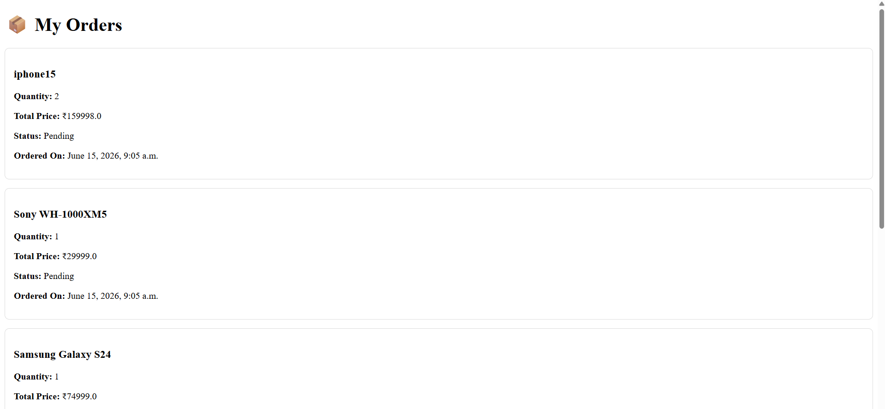

#  Django E-Commerce Store

This project was developed as part of the **CodeAlpha Full Stack Development Internship**.

## Project Overview

A fully functional E-Commerce web application built using Django. Users can browse products, view product details, add items to their cart, place orders, and manage their accounts.

## Features

* User Registration & Login
* Product Listings
* Product Detail Page
* Shopping Cart
* Order Processing
* Product Search
* Orders History
* Admin Panel

## Tech Stack

* Frontend: HTML, CSS, JavaScript
* Backend: Django (Python)
* Database: SQLite
* Version Control: Git & GitHub

## 📸 Screenshots

### Home Page

### Product Detail Page

### Cart Page

### Orders Page

### Login Page

### Register Page

## Future Improvements

* Payment Gateway Integration
* Product Categories
* Wishlist Functionality
* Product Reviews & Ratings
* Order Tracking System

##  GitHub Repository

Source code available in this repository.

## Author

Afsa Shaik

CodeAlpha Full Stack Development Intern
